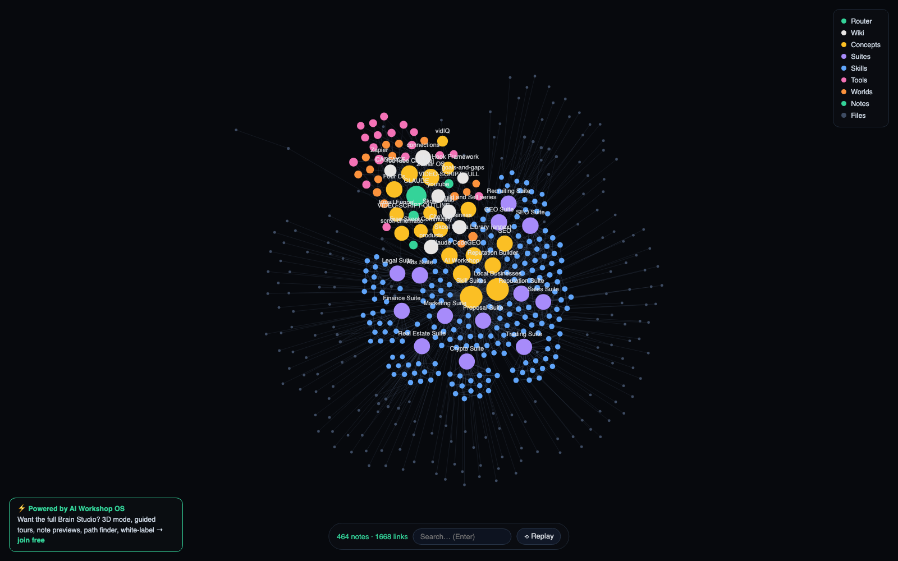
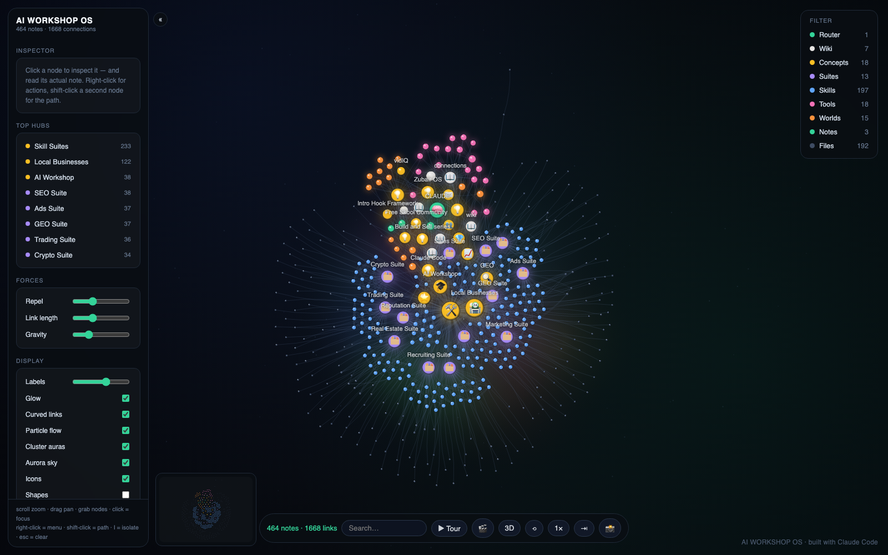

# brain-map

Turn any folder of markdown notes into an interactive knowledge graph — watch your second brain grow node by node, then explore it.

 



Works on any Obsidian vault, AI operating system, or plain folder of `.md` files. Connections come from `[[wikilinks]]` and relative markdown links; folders with no links still render as a clean structural tree.

## One-command install

```bash
curl -fsSL https://raw.githubusercontent.com/zubair-trabzada/brain-map/main/run.sh | bash -s -- ~/path/to/your/notes
```

Your brain opens at http://localhost:4710. No dependencies: Python 3 standard library and a browser.

<details>
<summary>Prefer to clone?</summary>

```bash
git clone https://github.com/zubair-trabzada/brain-map
cd brain-map
python3 build.py --vault ~/path/to/your/notes
python3 ~/path/to/your/notes/.brain-map/serve.py
```
</details>

## What you get

- **Growth animation** — your vault assembles itself from a single node (press R to replay)
- **Explore** — scroll to zoom, drag to pan, grab nodes, click to highlight connections
- **Search** — find any note and fly to it
- Auto-grouping and colors by folder; node size by connection count

## How to use it

Once it opens in your browser:

| Action | How |
|---|---|
| Watch your brain grow | plays automatically on load — press **R** (or the ⟲ Replay button) to watch it again |
| Move around | **drag** empty space to pan, **scroll** to zoom in and out |
| See a note's connections | **click** any node — it and its links stay lit, everything else fades. Click again (or press **Esc**) to release |
| Read what a node is | **hover** it to see its name |
| Rearrange the graph | **grab and drag** any node — the physics follows |
| Find a note | type in the **search box** and press **Enter** — the camera flies to it |
| See what the colors mean | legend in the top-right corner (groups = your folders) |

**Good to know:**

- The terminal window is the server — keep it open while you explore, **Ctrl+C** to stop. Run the same command again anytime.
- **Added or edited notes?** Just re-run the command — the graph regenerates from the current state of your folder in about a second.
- **Graph looks sparse?** Connections come from `[[wikilinks]]` and markdown links between your notes. The more you link your notes, the denser and more alive the brain gets — folders with no links at all still show as a structural tree.
- Everything runs 100% locally. Your notes never leave your machine.

## Want the full Brain Studio?



The free version is the demo. The full **Brain Studio** — exclusive to [AI Workshop](https://www.skool.com/aiworkshop) members — adds:

- 🌌 **3D galaxy mode** with fly-through camera
- 📖 **Note previews** — read your actual notes inside the graph
- 🎬 **Guided tour mode** + cinematic drift camera (auto B-roll)
- 🔦 Path finder, isolate mode, radial menus, pinning, depth dial
- 🔥 Heatmap mode, 4 themes, cluster auras, glossy rendering
- 🏷 **White-label branding** — put your client's logo on their business brain
- ⚡ **One-command install as a Claude Code skill** (`/brain-map`)

→ **[Join the AI Workshop to get it](https://www.skool.com/aiworkshop)**

---

Built with [Claude Code](https://claude.com/claude-code) · an [AI Workshop](https://www.skool.com/aiworkshop) project
